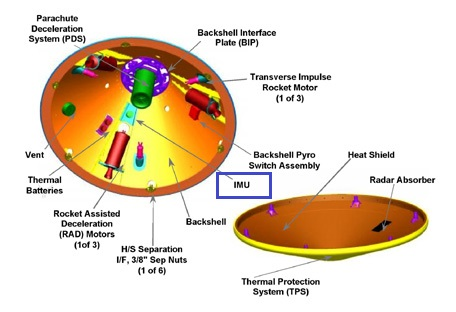

## Overview

Mars Exploration Rover(MER) is NASA's robotic space mission involving two rovers, Spirit and Opportunity.<br>
They landed on the opposite sides of the red planet in January, 2004 and trekked for miles across the Martian surface, conducting field geology and making atmospheric observations.<br>
Both the rovers carried identical, sophisticated sets of science instruments and found evidence of ancient Martian environments where intermittently wet and habitable conditions existed.

## Inertial Measurement Unit

The Inertial Measurement Unit measures the angular rate of the Rovers.<br>



Each rover was provided with two Inertial Measurement Units(IMU), one within the rover and one within the backshell.<br>
The dataset used here includes reduced data from includes from Entry, Descent, and Landing (EDL) phases of each rover mission, specifically measurements from the accelerometers and gyros within the two inertial measurement units (IMUs).

## MERIMU Analysis

This repo attempts to analyse the Highrate and Transformed data against Spacecraft clock count.

#### Pre-requisites

The modules essential for executing these scripts locally can be installed using pip,

```commandline
pip install -r requirements.txt
```

#### Generation of interactive analysis

The interactive analysis of highrate data can be generated by using,

```commandline
python highrate_data_analysis.py
```

The interactive analysis of transformed data can be generated by using,

```commandline
python transformed_data_analysis.py
```

#### Example reports

The sample reports of the analysis can be found underneath, reports directory.

## Note

Corrections and suggestions are always welcome.<br>
Kindly share your thoughts via kamalikoshy97@gmail.com
